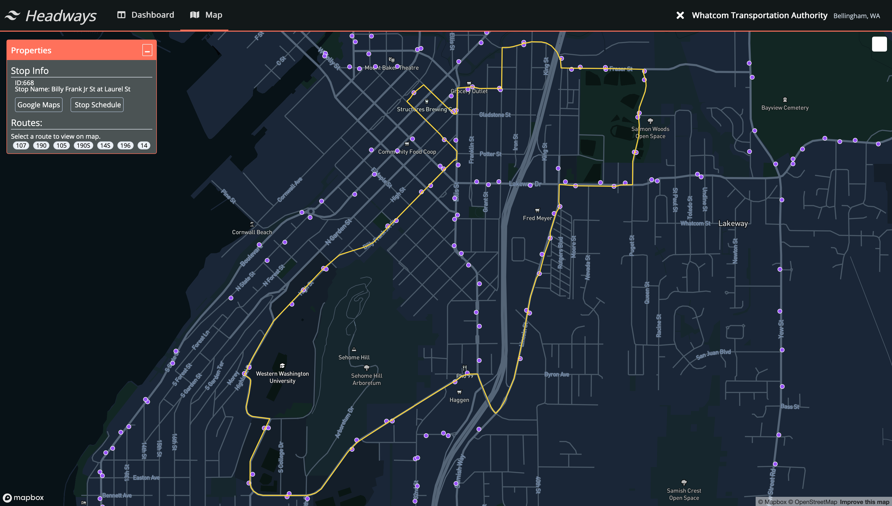

# Software Background
My degree might say "Electrical Engineer", but that doesn't mean I haven't ventured into other types of engineering. In particular, I have done a lot of work in web development. My primary income through college has been freelance web development. I am entirely self taught, which I believe to be an asset rather than a hinderance, since it proves that I am able to learn and grow as different skills are needed to complete a job. 

## Headways
My main personal project right now is Headways, which is for transit schedule analysis. This is a full stack project, I have written all the components of it- from importing the schedules, processing the database into an API, and the entire front-end UI. I've worked hard to create a project that is cohesive, not buggy, and professional.

To facilitate that, I am using industry-standard tools like linting, formatting, and unit testing. 

Here's a look at the main page- a map showing all stops. 

## Viasat Internship
In the summer of 2019, I worked at Viasat, a satellite internet company based in San Diego. My project included two components, which I worked on with one other intern:

- A PDF parser (which I wrote in python), which took in a poorly formatted PDF document of several thousands of pages, parsing it into a JSON database. 
- A data reduction engine in C++ whose input was binary data from a digital radio, and would convert it to human readable text using the database generated from the PDF. 

This project was my first time working in C++ (embedded software is mostly C), so I learned a lot of concepts around object oriented programming. 